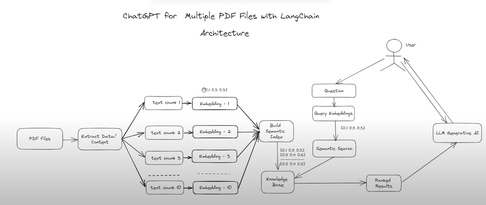

# Introduction

The Olive Chat App is a Python application that allows you to chat with multiple documents. You can ask questions about the document using natural language, and the application will provide relevant responses based on the content of the documents. This app utilizes a language model to generate accurate answers to your queries. Please note that the app will only respond to questions related to the loaded PDFs.

# How It Works

The application follows these steps to provide responses to your questions:

1- PDF/Docx Loading: The app reads multiple PDF or Doc documents and extracts their text content.

2- Text Chunking: The extracted text is divided into smaller chunks that can be processed effectively.

3- Language Model: The application utilizes a language model to generate vector representations (embeddings) of the text chunks.

4- Similarity Matching: When you ask a question, the app compares it with the text chunks and identifies the most semantically similar ones.

5- Response Generation: The selected chunks are passed to the language model, which generates a response based on the relevant content of the PDFs.

# Olive Customer Chatbot

1- Create Virtual environment 

2- Install dependencies 

3- Download LaMini-T5-738M Model from Huggigface

4- Run - "Python ingest.py"

5- Run - "streamlit run app.py"

# Open Source Tools Used:

1- Langchain: Langchain is a powerful library designed for generative AI tasks, providing a range of capabilities that enhance language generation and understanding. 

2- Chroma Db: ChromaDB, on the other hand, acts as a vector store and database, enabling us to store and retrieve vectors efficiently. By integrating ChromaDB into our search tool, we can create a robust and scalable solution for managing the vector representations of PDF documents, allowing for faster and more accurate searches.

3- Document QA Retrivel Model: utilize an Open Source LLM (Language Model) to enable question-answering capabilities within our search tool. With the power of LLM, we can process user queries and extract relevant information from PDF documents, providing precise and context-aware answers to the user's questions.

# Useful Links 

LaMiNi LM Model: https://huggingface.co/MBZUAI/LaMini-T5-738M

ChromaDB: https://www.trychroma.com/

Langchain: https://python.langchain.com/docs/get_started/introduction.html
